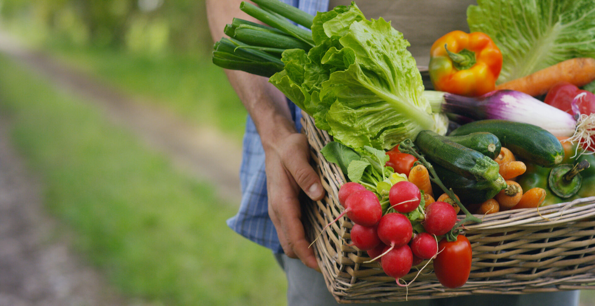
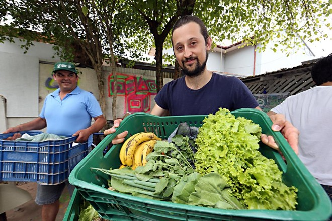
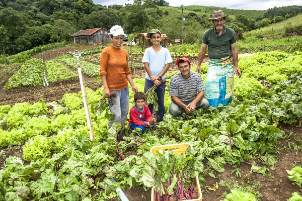

# AgroMart 

  

 

 O AgroMart nasceu para transformar a forma como nos relacionamos com a agricultura familiar. Criado durante um Hackathon na UnB – FGA em 2020, no auge da pandemia, o projeto surgiu de um desafio simples e poderoso: aproximar agricultores e consumidores em um momento em que a conexão era mais necessária do que nunca.

 Mais do que uma solução tecnológica, o AgroMart é um movimento. Uma plataforma que coloca o pequeno agricultor no centro, dando visibilidade à sua produção e garantindo que cada colheita encontre destino certo. Ao mesmo tempo, abre caminho para que consumidores descubram alimentos frescos, saudáveis e de qualidade, vindos direto de quem planta.

 Inspirado no modelo de CSA (Community Supported Agriculture), o AgroMart fortalece comunidades, cria laços de confiança e promove uma economia mais justa e sustentável. É sobre reduzir distâncias, valorizar o que é local e construir uma rede onde todos ganham: o agricultor que escoa sua produção, o consumidor que encontra comida de verdade, e a sociedade que se beneficia de uma agricultura mais próxima e humana.

## Conheça o que é uma CSA

> As **Comunidades que Sustentam a Agricultura (CSA)** aproximam consumidores e agricultores por meio de uma parceria de confiança, transparência e apoio mútuo.

-   :material-account-group: **Comunidade CSA**  
    Parceria transforma consumidores em coagricultores.  
    { width="260" }  
    [:octicons-link-external-24: Acessar notícia](https://www.gazetadopovo.com.br/agronegocio/mercado/parceria-transforma-consumidores-em-coagricultores-7p7jkku0vm0m6ds7nsa8zu9fj/)

-   :material-seed: **Transparência e Origem**  
    Produtos de origem conhecida e relação direta com quem produz.  
    { width="260" }  
    [:octicons-link-external-24: Ler mais](https://sebraepr.com.br/impulsiona/csa-comunidade-que-sustenta-a-agricultura/?srsltid=AfmBOoqjeBrYT1dipT8f7cXHNmEgm3yamL-Oya9prVa1uDw-kAOr7vY0)

-   :material-cash-multiple: **Economia Local**  
    CSA é um caminho que proporciona mais sustentabilidade.  
    { width="260" }  
    [:octicons-link-external-24: Saiba mais](https://csabrasil.org/csa/sobre/)

---

## Explore o AgroMart

-   :material-cellphone: **Aplicativo AgroMart (Mobile)**  
    Aplicativo Android/iOS integrado à API AgroMart.  
    [:octicons-link-external-24: Ver Repositório](https://github.com/AgroMart/mobile-client)

-   :material-monitor: **Plataforma AgroMart (Web)**  
    Interface Web do AgroMart para consumidores e produtores.  
    [:octicons-link-external-24: Ver Repositório](https://github.com/AgroMart/agromart-web)

